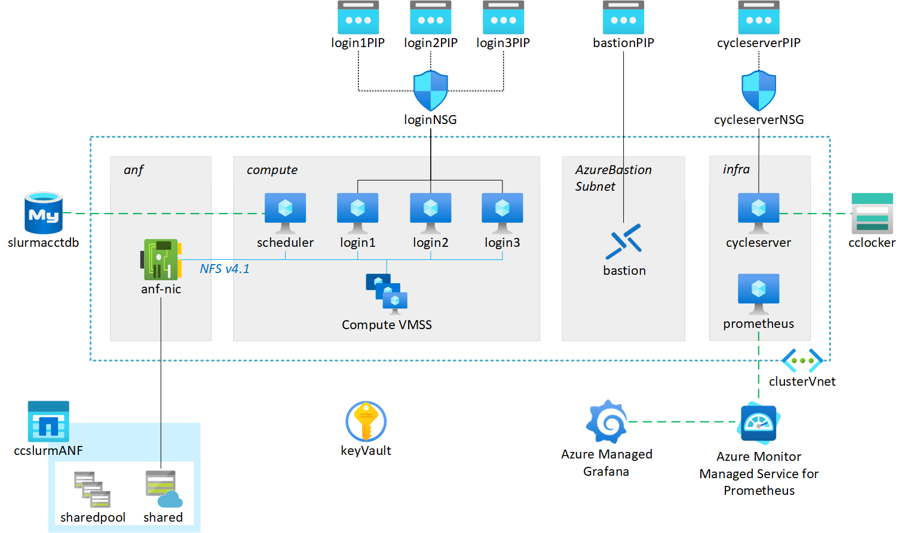
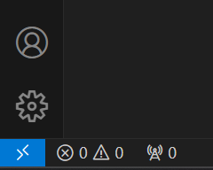
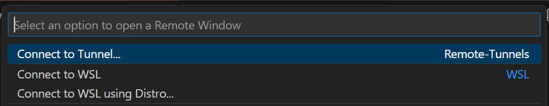
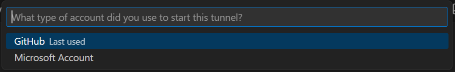
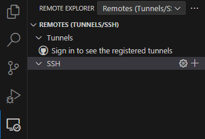
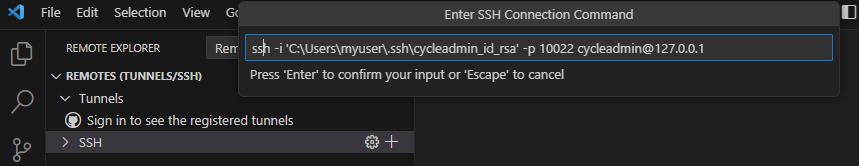
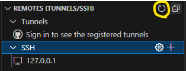
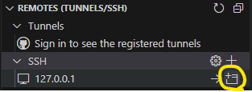
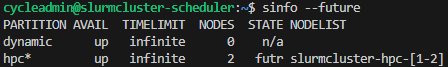
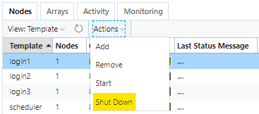

# CycleCloud Slurm cluster for AI <!-- omit from toc -->

- [Overview](#overview)
- [Prerequisites](#prerequisites)
- [Deployment](#deployment)
- [Connection](#connection)
  - [Using Bastion](#using-bastion)
  - [Using public IPs](#using-public-ips)
  - [Visual Studio Code](#visual-studio-code)
    - [Use code tunnel from the target VM](#use-code-tunnel-from-the-target-vm)
    - [Open a tunnel from local computer](#open-a-tunnel-from-local-computer)
- [Nodes management](#nodes-management)
- [Users management](#users-management)
- [Cluster customization](#cluster-customization)
  - [Login nodes](#login-nodes)
  - [CycleCloud cluster template and projects](#cyclecloud-cluster-template-and-projects)

## Overview

This infrastructure-as-code template automates the deployment of a CycleCloud Slurm cluster for running AI applications on Azure.
The Azure infrastructure is deployed using Bicep while the configuration of all the components is performed with Ansible.



## Prerequisites

- A Linux terminal with Bash shell (on Windows use [WSL2](https://learn.microsoft.com/en-us/windows/wsl/install)).
- Azure CLI installed ([docs here](https://learn.microsoft.com/en-us/cli/azure/install-azure-cli-linux?pivots=apt)) and signed into the desired Azure tenant ([docs here](https://learn.microsoft.com/en-us/cli/azure/authenticate-azure-cli-interactively)).
- The following Azure CLI extensions must be installed ([docs here](https://learn.microsoft.com/en-us/cli/azure/azure-cli-extensions-overview)):
  - ssh: `az extension add --name ssh`
  - bastion: `az extension add --name bastion`
- Your Azure account must have "Owner" role on the target subscription and resource group.
- When using the default configuration, the target subscription must have the follwing minimum compute quota (see [here](https://learn.microsoft.com/en-us/azure/networking/check-usage-against-limits#azure-portal) on how to check):
  - Standard NDSH100v5: 192 vCPUs
  - Standard Dsv4: 36 vCPUs
- Additional software:
  - *jq* JSON processor
  - *yq* YAML processor
  - *perl* interpreter
  - *rsync*
  - *git*

## Deployment

1. Clone this repository in the local machine:

   ```bash
   git clone https://github.com/vanzod/ccslurm4ai.git
   ```

   and change into the newly created directory:

   ```bash
   cd ccslurm4ai
   ```

2. Edit the `config.yaml` file with the required and optional paramaters in the table below.
   
   | Parameter             | Description                               | Required | Value                                                |
   | --------------------- | ----------------------------------------- | -------- | ----------------------------------------------------- |
   | `region`              | Azure region                              | Yes      | *string*                                              |
   | `subscription_name`   | Subscription name                         | Yes      | *string*                                              |
   | `resource_group_name` | Resource group name                       | Yes      | *string*                                              |
   | `hpc_sku`             | VM series name for HPC partition nodes    | Yes      | Standard_ND96amsr_A100_v4<br>Standard_ND96isr_H100_v5 |
   | `hpc_max_core_count`  | Total vCPU core count for HPC partition   | Yes      | *int* > 0                                             |
   | `resource_group_tags` | Tags to assign to resource group          | No       | *dictionary*                                          |
   | `monitor_tags`        | Tags to assign to Azure Monitor Workspace | No       | *dictionary*                                          |

3. Execute the install script:

   ```bash
   ./install.sh
   ```

   If ran without options, the install script will first perform the infrastructure deployment through Bicep and then the configurations via Ansible. It also provides the option of running a single step by using the `-a` flag for Ansible or `-b` for Bicep. This is useful for applying changes to the template after the initial deployment.

## Connection

The install script will automatically generate a set of new SSH keys for the `cycleadmin` user. Such keys and the CycleCloud password for this user are then stored in a Key Vault in the target resource group.

### Using Bastion

For security reasons access to all VMs is allowed only through [Bastion](https://learn.microsoft.com/en-us/azure/bastion/bastion-overview) by default.

The installer script will automatically generate a set of Bash scripts to simplify the connection as *cycleadmin* to the deployed resources through Bastion. There are two sets of scripts to perform two different actions:

- **Connect via SSH** (`bastion_ssh_*.sh`)

  The script opens an SSH connection to the desired resource (cycleserver/scheduler/login nodes).

  Since multiple login nodes are deployed (3 in the default configuration), the `bastion_ssh_login.sh` accepts an optional integer parameter corresponding to the desired login node to connect to. For example, to connect to the `login2` VM:

  ```bash
  ./bastion_ssh_login.sh 2
  ```

  The default value is 1 if no optional index is provided.

- **Open a tunnel to a VM** (`bastion_tunnel_*.ssh`)

  The script opens a tunnel to a target port on the remote VM on the specified local port. The command syntax is the following:

  ```bash
  ./bastion_tunnel_scheduler.sh <target_port> <local_port>
  ./bastion_tunnel_login.sh <target_port> <local_port> [VM index]
  ```

  Note that the last optional integer parameter indicates which of the login VMs to target and is not required for cycleserver and scheduler VMs.

  Terminating the script execution with `Ctrl+C` will close the tunnel.

  Some examples where this script can be useful are:

  - *Open a tunnel and perform data transfer from/to the remote VM*

    On a terminal, open the tunnel targeting the remote SSH port (in the example on `login3`) as follows:

    ```bash
    ./bastion_tunnel_login.sh 22 10022 3
    ```

    on a separate terminal, start the file transfer (in this case with `scp`) targeting port 10022 on the local host:

    ```bash
    scp -P 10022 test_file.txt cycleadmin@127.0.0.1:
    ```

  - *Open the CycleCloud portal from your local browser*

    On a terminal, open the tunnel targeting the remote HTTPS port on `cycleserver` as follows:

    ```bash
    ./bastion_tunnel_cycleserver.sh 443 10443
    ```

    Open your internet browser and use the URL: `https://127.0.0.1:10443`

### Using public IPs

**This option is strongly discouraged as it would increase the exposure of your infrastructure to external attacks.**

The infrastructure configuration provides public IPs for the cycleserver and login nodes. By default no external traffic is allowed to reach those VMs. To change this, simply add an inbound security rule to the corresponding Network Security Group as described [here](https://learn.microsoft.com/en-us/azure/virtual-network/manage-network-security-group?tabs=network-security-group-portal#create-a-security-rule}).

### Visual Studio Code

You can connect to the Slurm cluster scheduler or login nodes as Visual Studio Code remotes in two ways.

#### Use code tunnel from the target VM

Please note that this method requires a valid GitHub account.

First connect to the desired VM (in this example `login1`) by using the script generated at deployment:

```bash
./bastion_ssh_login 1
```

In the VM terminal, start the tunnel using the Code CLI:

```bash
slurmcluster-login1:~$ code tunnel
```

If this is the first time a tunnel is opened from this VM, Code CLI will ask to authenticate via GitHub. Use the web browser to reach https://github.com/login/device, use the code provided in the command output and authorize the required access. Keep this process running in the open terminal to keep the tunnel open.

Open a local Visual Studio Code window and click on the blue icon on the bottom left corner to open a remote window:



Then select "Connect to Tunnel..." in the drop-down menu:



followed by "GitHub" as the type of account used to start the tunnel:



Once successfully connected to the GitHub account, select the remote VM name.

The local Visual Studio Code instance is now connected to the remote VM.

#### Open a tunnel from local computer

On a terminal in the local computer, open the tunnel targeting the remote SSH port (in the example on `login3`) by using the generated script as follows:

```bash
./bastion_tunnel_login.sh 22 10022 3
```

After installing the Remote Explorer extension in VS Code and copying the user private SSH key to a location in the Windows file system, select the Remote Explorer icon on the left bar and select "Remotes (Tunnels/SSH) in the drop-down menu:



Create a new SSH remote by clicking on the + icon and adding the ssh command line (with the appropriate changes for SSH key path and remote user name) as shown below:



Hit enter and select the SSH config file to add the remote settings to.

After reloading the remotes by clicking on the highlighted icon, the new remote connection will appear in the SSH list:



Now the remote configuration is complete. To connect to the target VM, hover on the remote line and click on the "Connect in New Window" icon:



## Nodes management

The default CycleCloud Slurm cluster configuration does not enable autoscale on the cluster as deploying ND VMs is a time consuming process. Hence compute nodes must be manually started and terminated.

When the Slurm cluster is first started, all nodes are set in FUTURE state:



To start one or more nodes, use the following command:

```bash
sudo /opt/azurehpc/slurm/resume_program.sh slurmcluster-hpc-[1-2]
```

Note that the script accepts node names compliant to Slurm nomenclature.

Similarly, nodes can be terminated with:

```bash
sudo /opt/azurehpc/slurm/suspend_program.sh slurmcluster-hpc-[1-2]
```

To prevent affecting running jobs it is important to ensure that no jobs are running on nodes that are being terminated by draining nodes first.

## Users management

The cluster users management is provided through CycleCloud built-in authentication system. Detailed documentation can be found [here](https://learn.microsoft.com/en-us/azure/cyclecloud/concepts/user-management).

Once the user and its SSH public key are added to CycleCloud, edit the `bastion_ssh_login.sh` and `bastion_tunnel_login.sh` scripts (or the equivalent ones for the scheduler if login nodes are not desired) with the appropriate username and private SSH key file path. The new user can now use those scripts to access the cluster through Bastion.

## Cluster customization

Although this project is aimed at providing an easy-to-deploy infrastructure, attention has been paid to ensure it can be easily used as starting platform for further customizations.

### Login nodes

The default Slurm cluster configuration creates three login nodes for user access to the cluster. If less or no login nodes are needed, select the desired node from the CycleCloud Portal and request a shut down from the Actions drop-down menu:



To resume a login node, select the Start option from the same menu.

### CycleCloud cluster template and projects

The Slurm CycleCloud cluster is configured by Ansible as part of the `cyclecloud_cluster` playbook role.

The cluster template and parameters files are stored as Jinja2 templates in `ansible/playbooks/roles/cyclecloud_cluster/templates` and can be modified to introduce the desired customizations.

Similarly, CycleCloud projects are stored in `ansible/playbooks/roles/cyclecloud_cluster/files/cc_projects`. The entire content of this directory is synced on the cycleserver VM and all the projects are automatically uploaded to the CycleCloud locker by Ansible.
